# Array & Linkedlist

### 자료구조란

대량의 데이터를 효율적으로 관리하기 위해, 데이터를 `저장 및 정렬`하는 방식
데이터를 어떤 방식으로 저장하고 정렬하느냐에 따라 추출 방식 등 데이터를 처리 및 조작하는데 필요한 코드가 달라진다.

### 자료구조의 분류
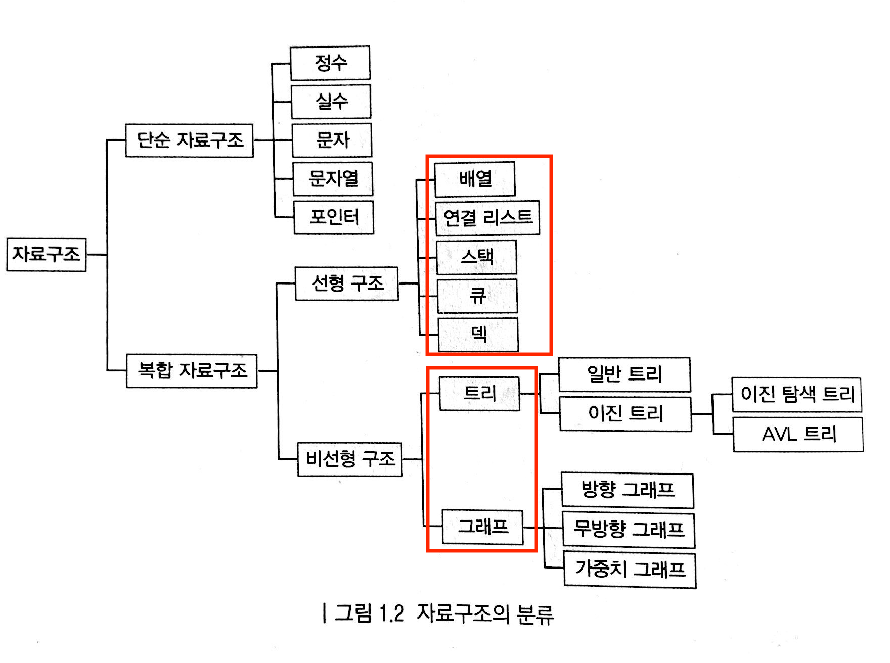

출처: 
https://velog.io/@neity16/%EC%9E%90%EB%A3%8C-%EA%B5%AC%EC%A1%B0Data-Structure

---
## Array

### 1.정의와 성질

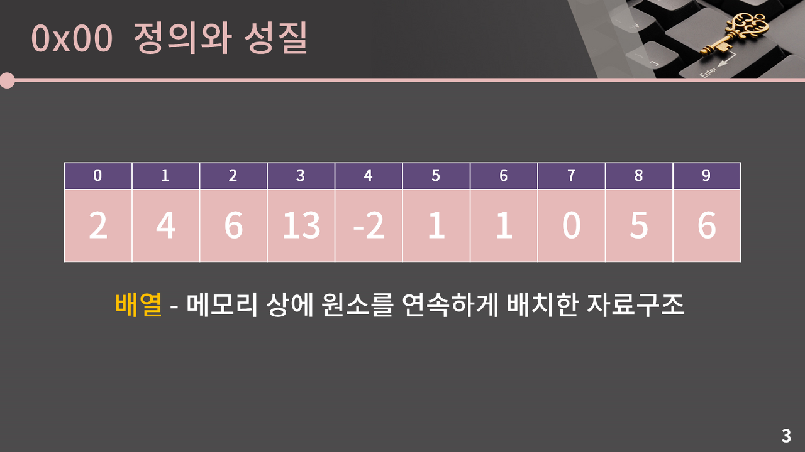

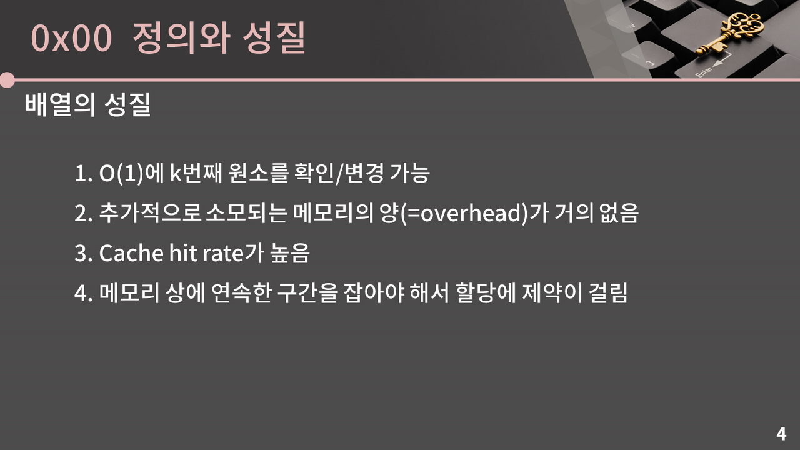

##### 캐시 히트율 이란, 캐시된 데이터를 요청할 때 해당 키 값이 메모리에 존재하여 얼마만큼의 비율로 잘 찾았는지에 대한 여부를 말합니다. 캐시 데이터를 잘 찾았다면 Cache hits 이라고 하며 반대로 캐시가 존재하지 않아 찾지 못했을 경우 Cache Misses 라고 합니다. 캐시 히트율이 높다는 것은 데이터베이스에서 읽어오는 비율보다 메모리에 캐시된 데이터를 읽어오는 비율이 높다는 의미이기 때문에 효율적으로 캐시를 사용하고 있다는 것입니다.  
> 캐시 히트율 = Keyspace-hits / (Keyspace-hits + Keyspace-misses)

### 2. 기능
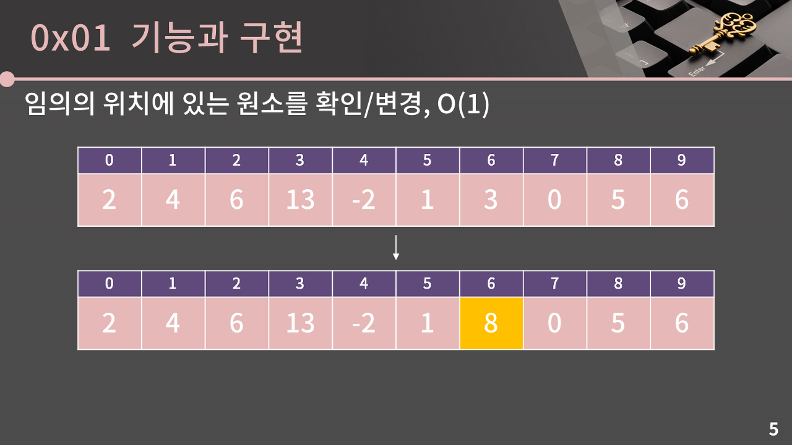
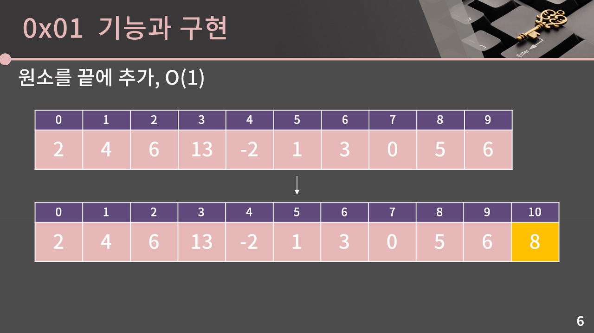
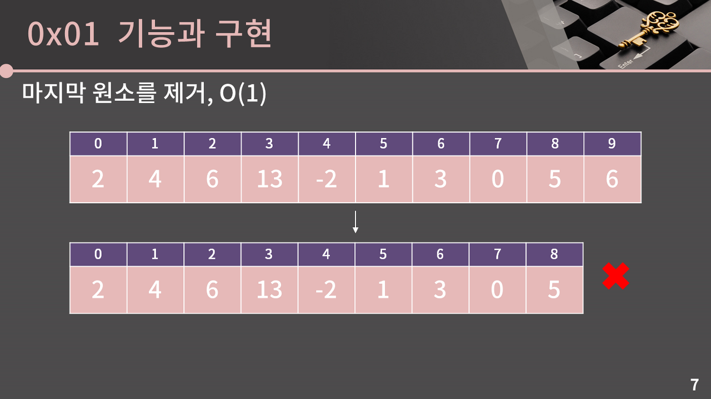
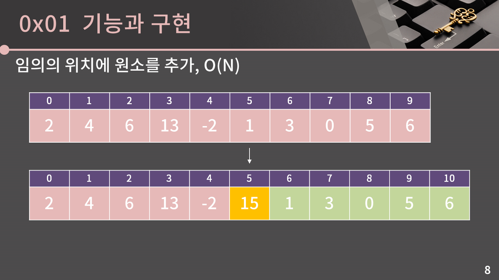
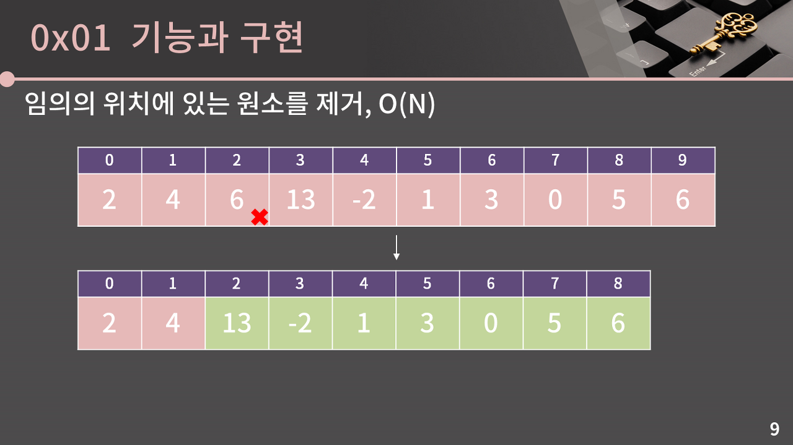

---
**INSERT 에 대해서만 자세히 보면**<br>
특정 Index에 특정 값(num) 을 중간에 삽입하려고 하면 삽입하려고 하는 index의 다음 index가 사라지는 문제
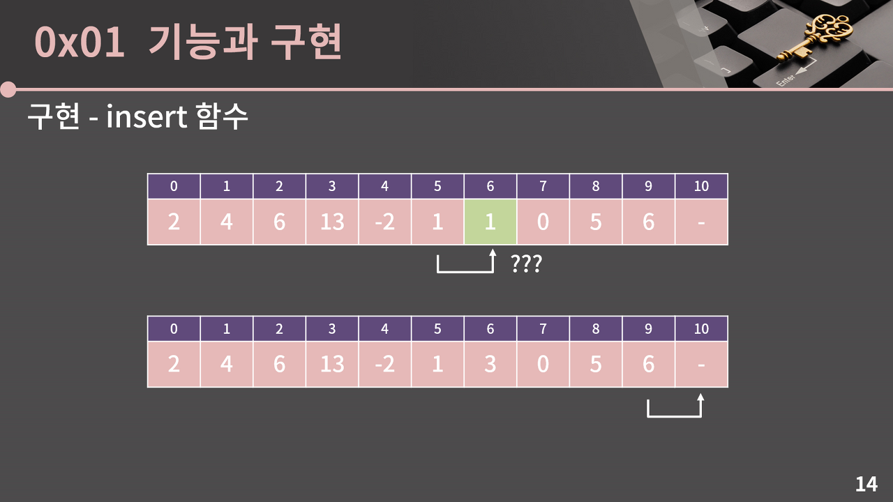
따라서 배열의 끝에서부터 삽입하려고 하는 Index까지 모두 +1씩 오른쪽으로 옮겨야 한다. 
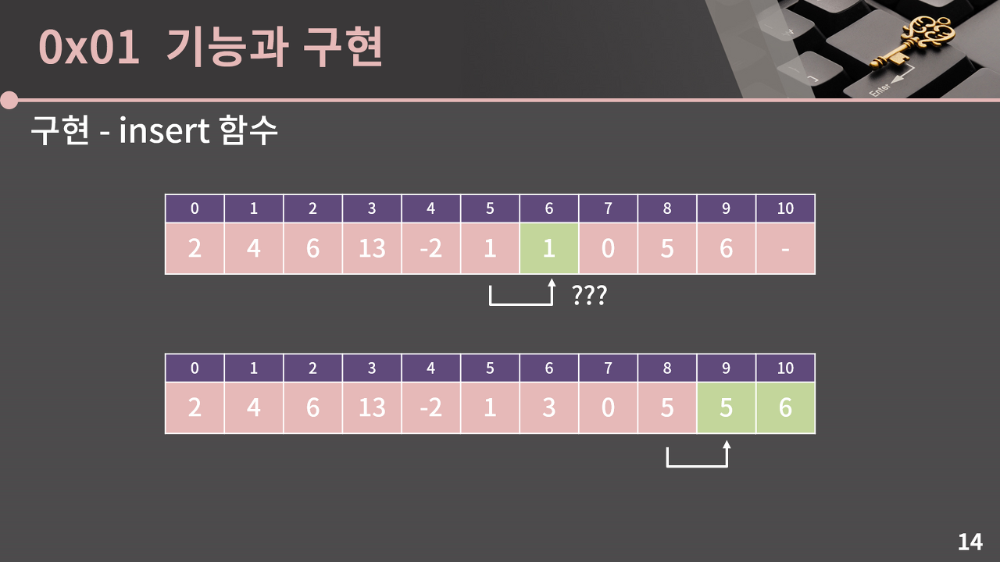
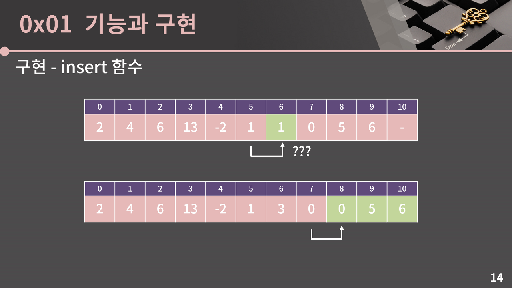
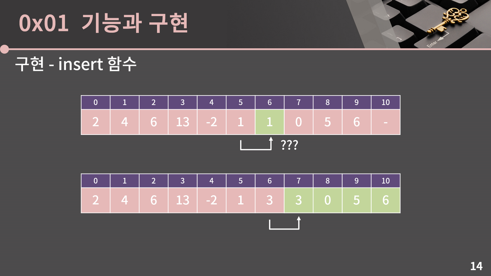
다 옮긴 뒤에 넣고자 하는 Index에 넣으려고 했던 num을 넣을 수 있다. 
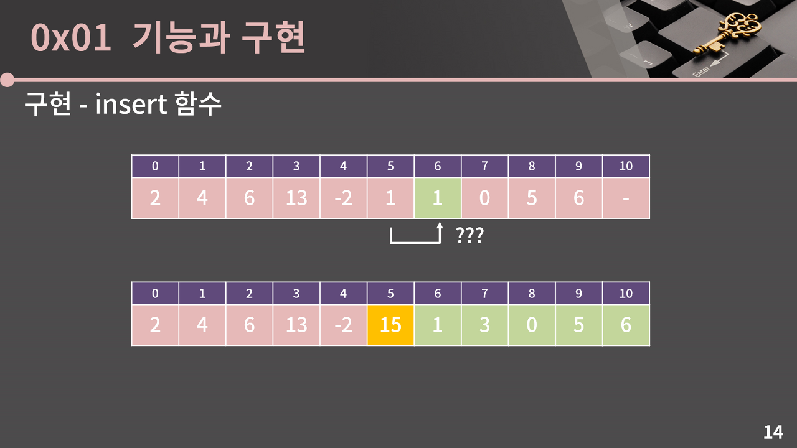

**ERASE**<br>
배열의 특정 Index의 값을 삭제하는 것은 그 Index부터 배열의 끝까지 -1씩 왼쪽으로 옮기면 된다. 
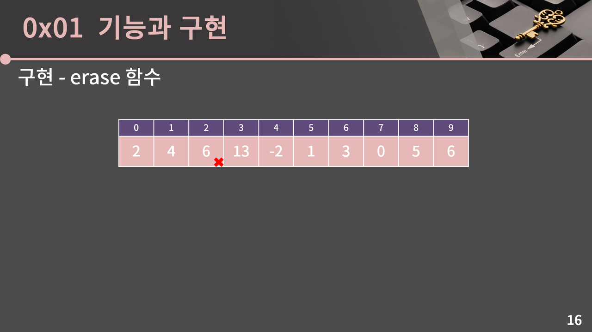
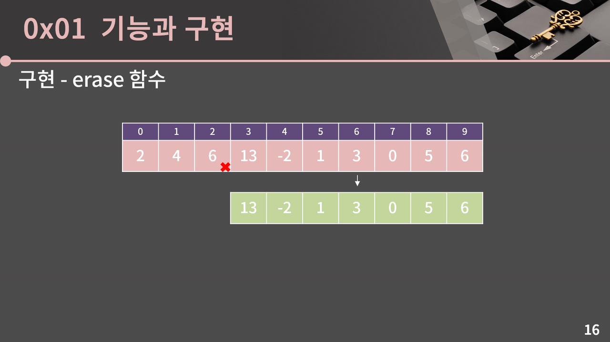
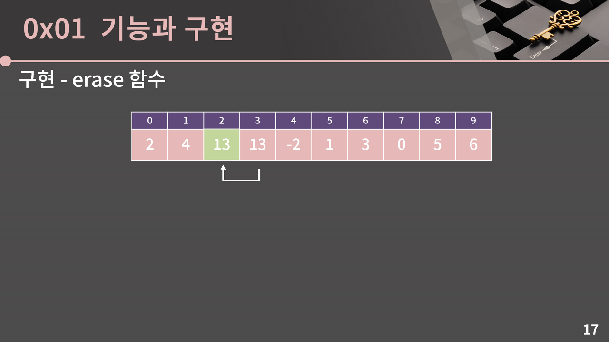
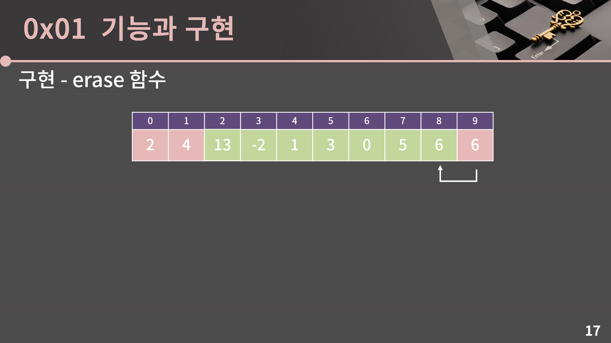


코드로 보면
```java
import java.util.Arrays;

public class Array {
    private int[] array;
    private int size;

    public Array(int capacity) {
        this.array = new int[capacity];
        this.size = 0;
    }

    public void insert(int num, int index) {
        if (index < 0 || index > size) {
            System.out.println("Index out of range.");
            return;
        }
        // 배열 크기가 부족한 경우 확장
        if (size == array.length) {
            expandArray();
        }

        // index 이후의 요소들을 한 칸씩 뒤로 이동
        for (int i = size - 1; i >= index; i--) {
            array[i + 1] = array[i];
        }

        // 새로운 요소 삽입
        array[index] = num;
        size++;
    }

    public void delete(int index) {
        if (index < 0 || index >= size) {
            System.out.println("Index out of range.");
            return;
        }

        // index 이후의 요소들을 한 칸씩 앞으로 이동
        for (int i = index; i < size - 1; i++) {
            array[i] = array[i + 1];
        }

        // 배열 크기 감소
        size--;
    }

    public int search(int element) {
        for (int i = 0; i < size; i++) {
            if (array[i] == element) {
                return i; // 찾은 경우 해당 인덱스 반환
            }
        }
        return -1; // 찾지 못한 경우 -1 반환
    }

    public void display() {
        System.out.println("Array: " + Arrays.toString(Arrays.copyOf(array, size)));
    }

    private void expandArray() {
        int newCapacity = array.length * 2;
        array = Arrays.copyOf(array, newCapacity);
    }

    public static void main(String[] args) {
        Array customArray = new Array(3);

        // 삽입
        customArray.insert(10, 0);
        customArray.insert(20, 1);
        customArray.insert(30, 2);
        customArray.display();  // 출력: Array: [10, 20, 30]
        customArray.insert(25, 2);
        customArray.display();  // 출력: Array: [10, 20, 25, 30]


        // 검색
        int searchResult = customArray.search(20);
        System.out.println("Search Result: " + (searchResult != -1 ? "At index " + searchResult : "not found"));

        // 삭제
        customArray.delete(1);
        customArray.display();  // 출력: Array: [10, 30]
    }
}
```
출처:
https://jane096.github.io/project/redis-caching/
https://blog.encrypted.gg/927

---
## Linked List

### 1.정의와 성질
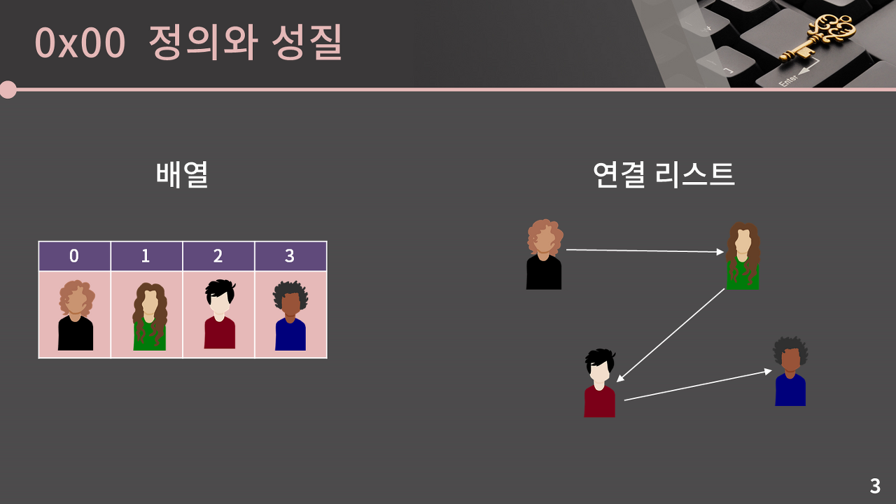   
연결리스트란, 원소들을 저장할 때 그 다음 원소가 있는 위치를 포함시키는 방식으로 저장하는 자료구조이다. 
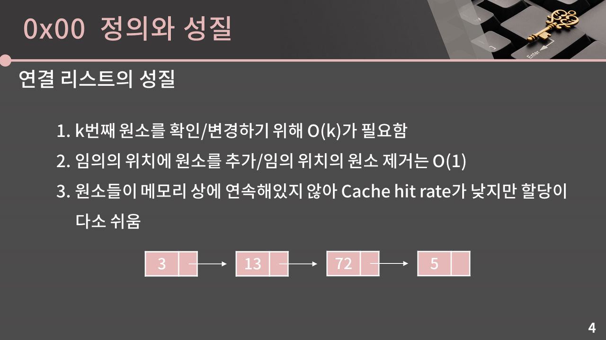

1. 이 그림은 3, 13, 72, 5를 저장하는 연결 리스트이다. 여기서 3번째 원소인 72를 찾고 싶으면 3을 거쳐서 13을 가고, 13을 거쳐서 72를 가야하기 때문에 O(k)의 시간이 필요. 
2. 연결 리스트에서는 임의의 위치에 원소를 추가하거나 임의 위치의 원소 제거가 O(1)이다. 배열과 비교했을 때 큰 차이가 있는 성질.
3. 메모리 상에 데이터들이 연속해있지 않으니까 Cache hit rate가 낮지만 할당이 쉽다.


### 2. 종류

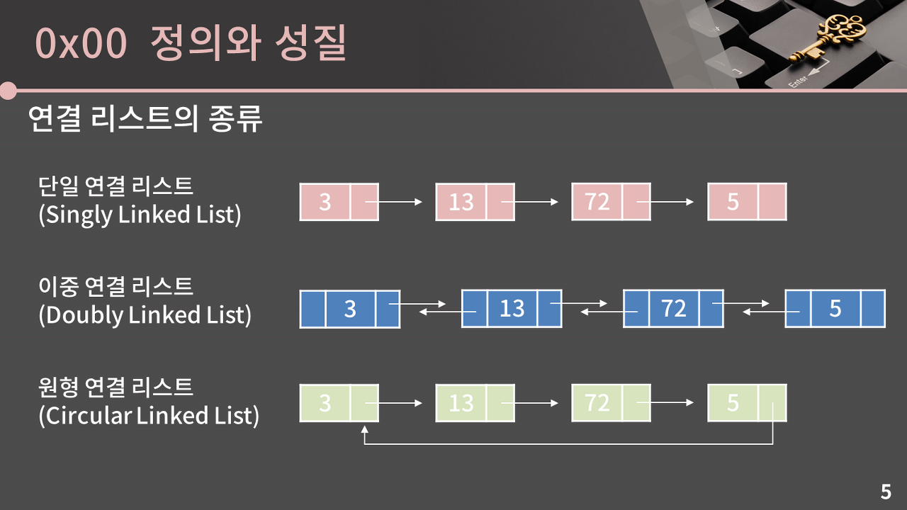

- 각 원소가 자신의 다음 원소의 주소
- 각 원소가 자신의 이전 원소와 다음 원소의 주소를 둘 다
- 끝이 처음과 연결(각 원소가 이전과 다음 원소의 주소를 모두 들고 있어도 상관이 없다.)
<br/>
<br/>

**임의의 위치에 있는 원소를 확인/변경하는 방법**<br>
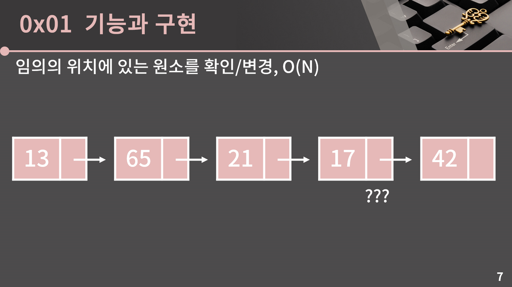
배열과는 다르게 임의의 위치에 있는 원소로 가기 위해서는 그 위치에 도달할 때 까지 첫 번째부터 순차적으로 방문.
 > 첫 번째 원소의 주소만 알고 있기 때문.
 
네 번째 원소의 값을 확인하고 싶다고 할 때, 첫 번째 원소에 기록된 주소를 보고 두 번째 원소로 넘어가고, 두 번째 원소에 기록된 주소를 보고 세 번째 원소로 넘어가고, 세 번째 원소에 기록된 주소를 보고 네 번째 원소로 넘어가서 확인할 수 있다.

> 그렇기 때문에 k번째 원소를 보기 위해서는 O(k)의 시간이 필요하고, 전체에 N개의 원소가 있다고 하면 평균적으로 N/2의 시간이 걸릴테니 O(N).
<br/>
<br/>


**임의의 위치에 INSERT**
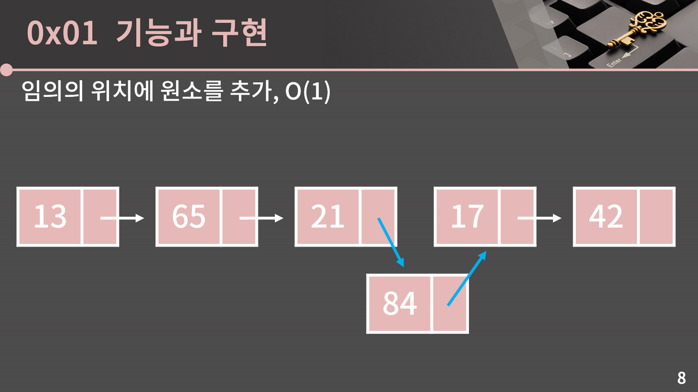
 O(1). 21 뒤에 84를 추가하고 싶다고 할 때, 배열처럼 그 뒤의 원소들을 전부 옮기는 작업을 할 필요가 없고 그냥 21과 84에서 다음 원소의 주소만 변경.

 > 단, 추가하고 싶은 위치의 주소를 알고 있을 경우에만 O(1). 만약 21의 주소를 준 것이 아니라 그냥 84라는 원소를 세 번째 원소 뒤에 추가하라는 명령의 경우에는, 세 번째 원소까지 찾아가야 하는 시간이 걸려서 O(1)이라고 말할 수 없다.


 **임의의 위치에 DELETE**
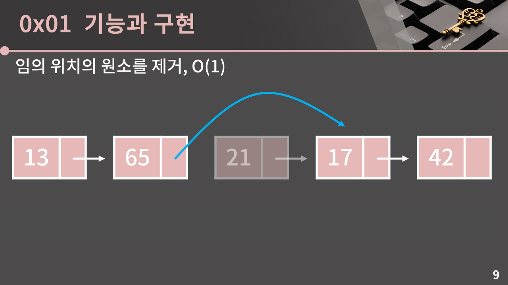
O(1). 21을 지우려고 하면 65에다가 "너의 다음 원소가 21이 아닌 17이다"라고만 알려주면 된다. 

**결론**
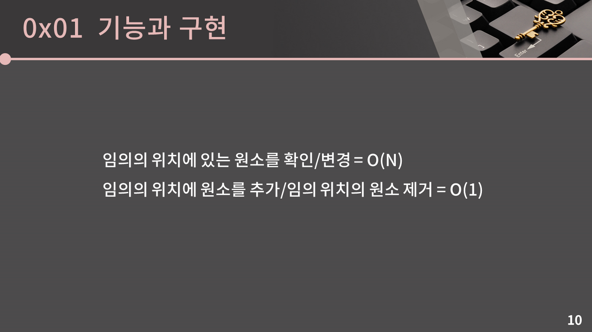

```java
package Linkedlist;

public class Practice {
	public static void main(String args[]) {
		LinkedList L = new LinkedList();
		System.out.println("(1) 공백 리스트에 노드 3개 삽입하기");
		L.insertLastNode("월");
		L.insertLastNode("수");
		L.insertLastNode("일");
		L.printList();

		System.out.println("(2) 수 노드 뒤에 금 노드 삽입하기");
		ListNode pre = L.searchNode("수");
		if (pre == null)
			System.out.println("검색실패>> 찾는 데이터가 없습니다.");
		else {
			L.insertMiddleNode(pre, "금");
			L.printList();
		}

		System.out.println("(3) 리스트의 마지막 노드 삭제하기");
		L.deleteLastNode();
		L.printList();
	}
}

// 2. LinkedList 정의
class LinkedList {
	// list의 첫번째 노드
	private ListNode head;

	public LinkedList() {
		head = null;
	}

	// Node 삽입 (중간에 삽입)
	public void insertMiddleNode(ListNode pre, String data) {
		ListNode newNode = new ListNode(data); // 새로운 노드 생성

		//  pre.link는 preNode의 다음 노드이므로,        
		//  newNode.link = pre.link는 새로운 노드의 link가 preNode의 다음 노드를 참조하도록 함. 
		newNode.link = pre.link;

		//  preNode의 link가 새로운 노드를 참조하도록 함.
		pre.link = newNode;
	}

	public void insertLastNode(String data) {
		ListNode newNode = new ListNode(data);
		//  head 노드가 null인 경우 새로운 노드를 참조하도록 함
		if (head == null) {
			this.head = newNode;
		} else {
			//  head 노드가 null이 아닌 경우 temp 노드가 head를 참조.            
			//  tempNode는 마지막 노드를 찾아서 참조하기 위해 사용.
			ListNode temp = head;
			//  temp 노드의 link가 null이 아닐 때까지 다음 노드를 참조.            
			//  tempNode.link는 다음 노드를 참조하고 있으므로,            
			//  tempNode = tempNode.link는 tempNode에 다음 노드를 참조하도록 하는 것.            
			//  while문이 모두 실행되면 tempNode는 가장 마지막 노드를 참조하게 됨.
			while (temp.link != null) {
				temp = temp.link;
			}
			// tempNode(마지막 노드)의 link가 다음 노드를 참조하도록 함. 
			temp.link = newNode;
		}
	}

	public void deleteNode(String data) {
		// preNode는 head가 가리키는 노드를 할당
		ListNode preNode = head;
        // tempNode는 head가 가리키는 노드의 다음 노드. 즉, preNode의 다음 노드를 할당
		ListNode tempNode = head.link;
		
		// 주어진 데이터가 preNode의 데이터와 일치하는 경우        
		// 즉, 첫번째 노드의 데이터와 일치하는 경우
		if(data.equals(preNode.getData())) {
			// head는 preNode의 다음 노드를 참조하도록 함.
			head = preNode.link;
			// preNode의 link는 null을 할당하여 연결을 끊음.
			preNode.link = null;
		}else {
			// tempNode가 null일 때까지 반복하여 탐색
			while(tempNode !=null) {
				// 주어진 데이터와 temp 노드의 데이터가 일치할 경우.
				if(data.equals(tempNode.getData())) {
					// tempNode가 마지막 노드인 경우
					if(tempNode.link==null) {
						preNode.link=null;
					}else {
						// tempNode가 마지막 노드가 아닌 경우                        
						// preNode의 link는 tempNode의 다음 노드를 참조.                        
						// tempNode의 link는 null을 할당하여 다음 노드로의 연결을 끊음.
						preNode.link= tempNode.link;
						tempNode.link = null;
					}
					break;
				}else {
					// 데이터가 일치하지 않을 경우                     
					// preNode에 tempNode를 할당하고, tempNode에 다음 노드 할당.
					preNode = tempNode;
					tempNode = tempNode.link;
				}
			}
		}
		
	}

	public void deleteLastNode() {
		ListNode preNode, tempNode;
		// head 노드가 null인 경우 모든 노드가 삭제되었으므로 return
		if (head == null)
			return;
		
		// head 노드의 link가 null인 경우        
		// 노드가 1개 남았을 경우
		if (head.link == null) {
			// head에 null을 할당하여 남은 노드와의 연결을 끊음.
			head = null;
		} else {
			// preNode는 head가 가리키는 노드를 할당
			preNode = head;
			// tempNode는 head가 가리키는 노드의 다음 노드. 즉, preNode의 다음 노드를 할당
			tempNode = head.link;
			// tempNode의 link가 null이 아닐 때까지 한 노드씩 다음 노드로 이동.            
			// preNode는 tempNode를 할당하고            
			// tempNode는 tempNode의 다음 노드를 할당.            
			// 이렇게 하면 preNode는 마지막 노드의 이전 노드가 되고, tempNode는 마지막 노드가 됨.
			while (tempNode.link != null) {
				preNode = tempNode;
				tempNode = tempNode.link;
			}
			// preNode의 link를 null로 만들어서 가장 마지막 노드를 삭제            
			// 즉, preNode의 다음 노드인 tempNode로의 연결을 끊음.
			preNode.link = null;
		}
	}

	public ListNode searchNode(String data) {
		ListNode tempNode = this.head;// temp 노드에 head가 가리키는 첫 번째 할당.
		
		// temp 노드가 null이 아닐 때까지 반복하여 탐색
		while (tempNode != null) {
			// 주어진 데이터와 temp 노드의 데이터가 일치할 경우 해당 temp 노드를 return
			if (data == tempNode.getData())
				return tempNode;
			else {
				// 데이터가 일치하지 않을 경우 temp 노드에 다음 노드 할당.
				tempNode = tempNode.link;
				}
		}
		return tempNode;
	}


	public void printList() {
		ListNode temp = this.head;// tempNode에 head가 가리키는 첫번째 노드를 할당
		System.out.printf("L = (");
		// tempNode가 null이 아닐 때까지 반복하여 출력
		while (temp != null) {
			System.out.printf(temp.getData());
			temp = temp.link; // temp 노드에 다음 노드(temp.link) 할당.
			if (temp != null) {
				System.out.printf(", ");
			}
		}
		System.out.println(")");
	}
}

//1. List를 구성하는 Node 클래스
class ListNode {
	private String data; // 데이터 저장 변수
	public ListNode link; // 다른 노드를 참조할 링크 노드

	public ListNode() {
		this.data = null;
		this.link = null;
	}

	public ListNode(String data) {
		this.data = data;
		this.link = null;
	}

	public ListNode(String data, ListNode link) {
		this.data = data;
		this.link = link;
	}

	public String getData() {
		return this.data;
	}
}

```

### 배열과 연결리스트의 차이
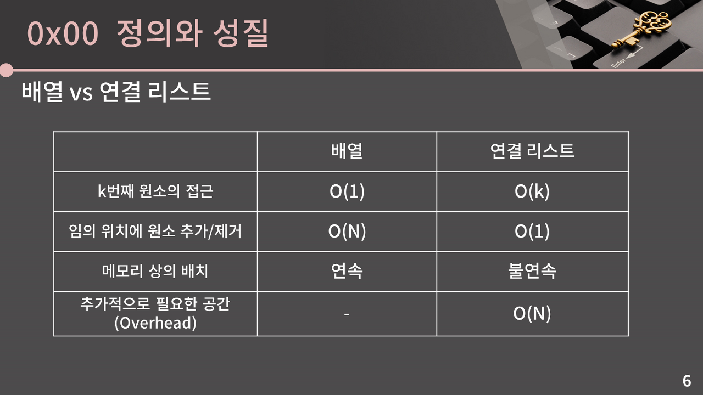

##### Overhead => 배열은 데이터만 저장하면 될 뿐 딱히 추가적으로 필요한 공간이 없습니다. 그런데 연결 리스트에서는 각 원소가 다음 원소, 혹은 이전과 다음 원소의 주소값을 가지고 있어야 한다. 그래서 32비트 컴퓨터면 주소값이 32비트(=4바이트) 단위이니 4N 바이트가 추가로 필요하고, 64비트 컴퓨터라면 주소값이 64비트(=8바이트) 단위이니 8N 바이트가 추가로 필요하게 된다. 즉 N에 비례하는 만큼의 메모리를 추가로 쓰게 된다.

출처:
https://freestrokes.tistory.com/84
https://blog.encrypted.gg/932
https://donghoson.tistory.com/m/157?category=799812


---

## :studio_microphone: 면접 대비
:question: Array(List)의 가장 큰 특징과 그로 인해 발생하는 장점과 단점에 대해 설명해주세요.
<details>
<summary>정답보기</summary>
Array의 가장 큰 특징은 순차적으로 데이터를 저장한다는 점입니다.데이터에 순서가 있기 때문에 0부터 시작하는 index가 존재하며, index를 사용해 특정 요소를 찾고 조작이 가능하다는 것이 Array의 장점입니다.순차적으로 존재하는 데이터의 중간에 요소가 삽입되거나 삭제되는 경우 그 뒤의 모든 요소들을 한 칸씩 뒤로 밀거나 당겨줘야 하는 단점도 있습니다.이러한 이유로 Array는 정보가 자주 삭제되거나 추가되는 데이터를 담기에는 적절치 않습니다.
</details>
<br/>

:question: Array를 적용시키면 좋을 데이터의 예를 구체적으로 들어주세요. 구체적 예시와 함께 Array를 적용하면 좋은 이유, 그리고 Array를 사용하지 않으면 어떻게 되는지 함께 설명해주세요.

<details>
<summary>정답보기</summary>
<div markdown="1">
Array를 적용시키면 좋은 예로 주식 차트가 있습니다.
주식 차트에 대한 데이터는 요소가 중간에 새롭게 추가되거나 삭제되는 정보가 아니며, 날짜별로 주식 가격이 차례대로 저장되어야 하는 데이터입니다.
즉, 순서가 중요한 데이터이므로 Array 같이 순서를 보장해주는 자료구조를 사용하는게 좋습니다.
Array를 사용하지 않고 순서가 없는 자료 구조를 사용할 경우에는 날짜별 주식 가격을 확인하기 어려우며 매번 전체 자료를 읽어 들이고 비교해야 하는 번거로움이 발생합니다.
</div>
</details>
<br/>

:question: Array와 ArrayList의 차이점에 대해 설명해주세요.
<details>
<summary> 정답보기</summary>
<div markdown="1">
Array는 크기가 고정적이고, ArrayList는 크기가 가변적입니다.Array는 초기화 시 메모리에 할당되어 ArrayList보다 속도가 빠르고,ArrayList는 데이터 추가 및 삭제 시 메모리를 재할당하기 때문에 속도가 Array보다 느립니다.
<details><summary>&nbsp; 더 자세한 설명</summary>
1. 접근
Array는 random access를 지원합니다. 요소들을 인덱스를 통해 직접 접근할 수 있습니다. 따라서 특정 요소에 접근하는 시간복잡도는 O(1)입니다.
LinkList는 sequential access를 지원합니다. 어떤 요소를 접근할 때 순차적으로 검색하며 찾아야합니다. 따라서 특정 요소에 접근할 때 시간복잡도는 O(n)입니다.

저장방식도 Array에서 요소들은 인접한 메모리 위치에 연이어 저장됩니다. 반면 LinkedList는 새로운 요소에 할당된 메모리 위치 주소가 LinkedList의 이전 요소에 저장됩니다.

2. 삽입과 삭제
Array에서 삽입과 삭제는 각 원소들을 shift 해줘야 하기 때문에 O(n)이 소요됩니다.
LinkedList는 각각의 원소들마다 자기 자신 다음에 어떤 원소인지만을 기억하고 있기 때문에 이 부분만 다른 값으로 바꿔주면 삽입과 삭제가 O(1)로 해결할 수 있습니다.
하지만, LinkedList는 원하는 위치에 한번에 접근할 수 없다는 단점이 있습니다. 따라서 원하는 위치를 찾기 위한 search 과정에 있어서 첫번째 원소부터 확인해야 합니다. 따라서 O(n) 시간이 추가적으로 발생하게 됩니다.

3. 메모리 할당
Array에서 메모리는 선언시 컴파일 타임에 할당이 됩니다.(정적 메모리 할당) 반면 LinkedList는 새로운 요소가 추가될 때 런타임에 메모리를 할당합니다.(동적 메모리 할당)
Array는 Stack 섹션에 메모리 할당이 이루어지는 반면, LinkedList는 Heap 섹션에 메모리 할당이 이루어집니다.
</details>

</div>
</details>
<br/>

:question: Array와 LinkedList의 장/단점에 대해 설명해주세요.
<details>
<summary>정답보기</summary>
<div markdown="1">
Array는 인덱스(index)로 해당 원소(element)에 접근할 수 있어 찾고자 하는 원소의 인덱스 값을 알고 있으면 O(1)에 해당 원소로 접근할 수 있습니다. 즉, RandomAccess가 가능해 속도가 빠르다는 장점이 있습니다.하지만 삽입 또는 삭제의 과정에서 각 원소들을 shift 해줘야 하는 비용이 생겨 이 경우 시간 복잡도는 O(n)이 된다는 단점이 있습니다.
이 문제점을 해결하기 위한 자료구조가 linkedlist입니다. 각각의 원소들은 자기 자신 다음에 어떤 원소인지만을 기억하고 있기 때문에 이 부분만 다른 값으로 바꿔주면 삽입과 삭제를 O(1)로 해결할 수 있습니다.하지만LinkedList는 원하는 위치에 한 번에 접근할 수 없다는 단점이 있습니다. 원하는 위치에 삽입을 하고자 하면 원하는 위치를 Search 과정에 있어서 첫번째 원소부터 다 확인해봐야 합니다.
간단히 정리하면,Array는 검색이 빠르지만, 삽입, 삭제가 느리다.LinkedList는 삽입, 삭제가 빠르지만, 검색이 느리다.
</div>
</details>
<br/>


출처 : https://dev-coco.tistory.com/159 <br/>
https://velog.io/@kkyes1210/CS-%EC%A0%95%EB%A6%AC-%EA%B8%B0%EC%88%A0-%EB%A9%B4%EC%A0%91-%EC%A7%88%EB%AC%B8-%EC%A0%95%EB%A6%AC-%EC%9E%90%EB%A3%8C%EA%B5%AC%EC%A1%B0


---


### Time Complexity

입력값의 크기에 따른 함수의 증가량  == 성장률   
중요하지 않은 상수와 계수들을 제거, 성장률에 집중하는 것을 **점근적표기법** 이라고 한다.     
가장 큰 영향을 주는 항만 계산      
점근적 표기법에는 세가지가 있다.   
- 최상의 경우 : 오메가 표기법 Big-Ω(빅-오메가)
- 평균의 경우 : 세타 표기법 Big-θ(빅-세타)
- 최악의 경우 : 빅오 표기법 Big-O(빅-오)        

평균인 세타표기를 하면 가장 정확하지만 평가하기 까다로워 최악의 경우인 빅오를 사용하는 알고리즘이 최악일때의 경우 판단하면 평균과 가까운 성능으로 예측할 수 있다.     
<br>
Big-O로 측정되는 복잡성에는 시간과 공간복잡도가 있는데
- 시간복잡도는 입력된 N의 크기에 따라 실행되는 조작의 수를 나타낸다. 
- 공간복잡도는 알고리즘이 실행될 때 사용하는 메모리의 양을 나타낸다. 요즘에는 데이터를 저장할 수 있는 메모리의 발전으로 중요도가 낮아졌다. 

### 시간복잡도
> 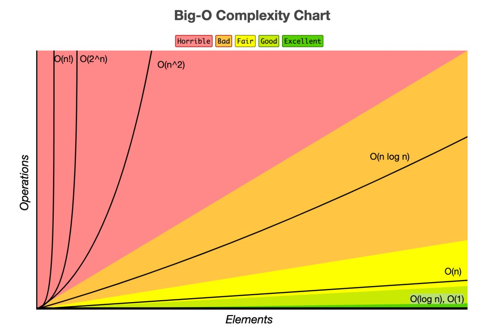
<br/>

**O(1)**
> 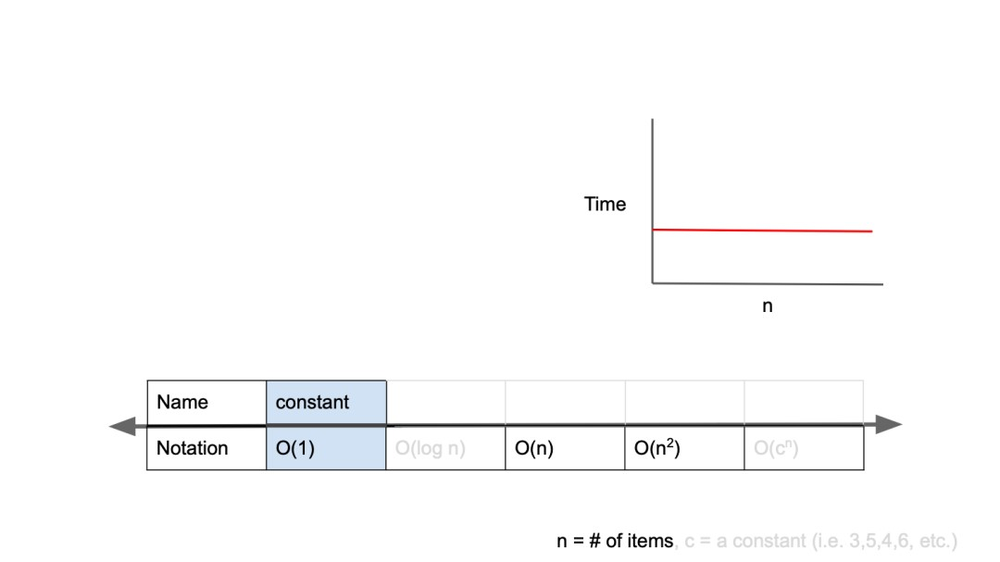
>&nbsp;&nbsp;O(1)는 일정한 복잡도(constant complexity)라고 하며, 입력값이 증가하더라도 시간이 늘어나지 않는다. 다시 말해 입력값의 크기와 관계없이, 즉시 출력값을 얻어낼 수 있다는 의미이다.
<br/>


**O(log n)**
>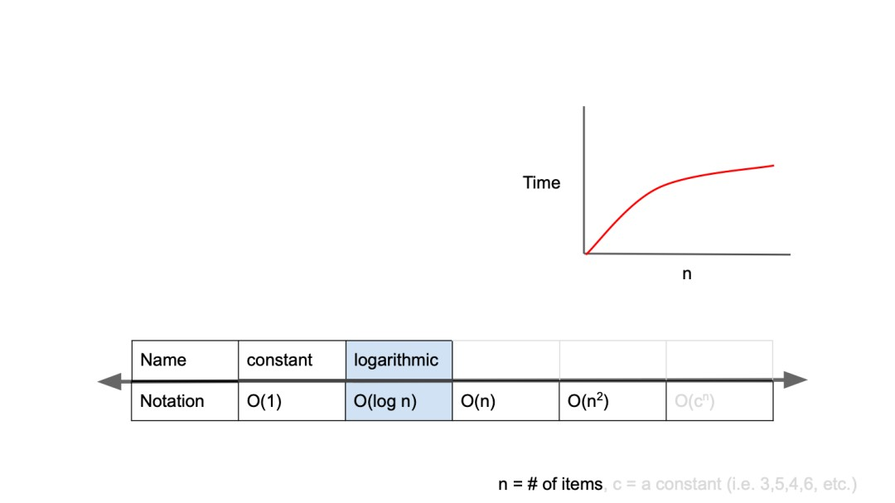
>&nbsp;&nbsp;O(log n)은 로그 복잡도(logarithmic complexity)라고 부르며, Big-O표기법중 O(1) 다음으로 빠른 시간 복잡도를 가진다. <br/>
>&nbsp;&nbsp;BST(Binary Search Tree)가 대표적인 예시이며, 노드를 이동할 때마다 경우의 수가 절반으로 줄어든다.
<br/>

**O(n)**
>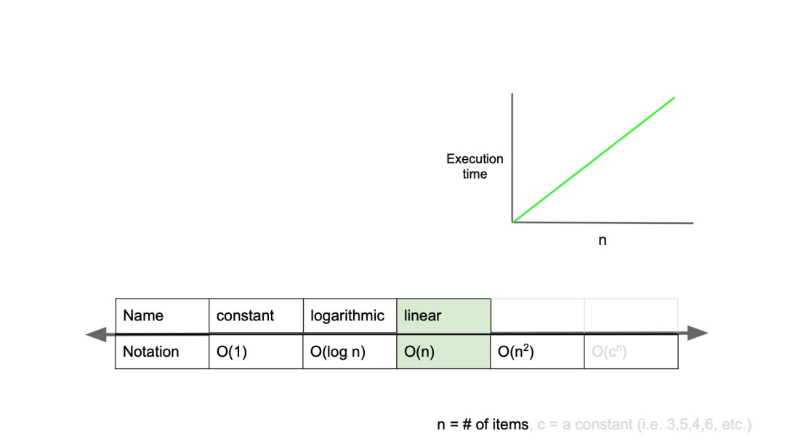
>&nbsp;&nbsp;O(n)은 선형 복잡도(linear complexity)라고 부르며, 입력값이 증가함에 따라 시간 또한 같은 비율로 증가하는 것을 의미한다.<br/>
>&nbsp;&nbsp;Array, Linked List, Stack, Hash table이 대표적인 예시이다. 
<br/>

**O(n<sup>2)**
>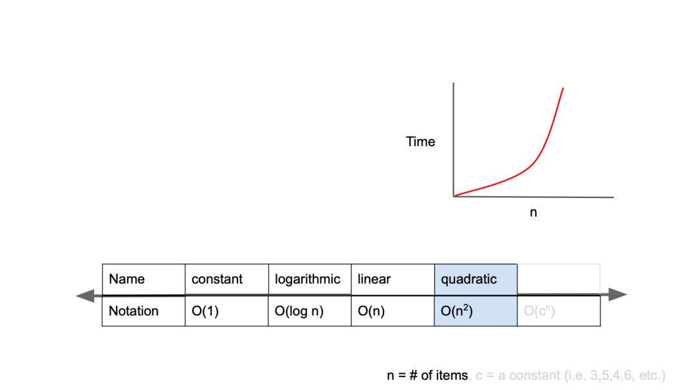
>&nbsp;&nbsp;O(n2)은 2차 복잡도(quadratic complexity)라고 부르며, 입력값이 증가함에 따라 시간이 n의 제곱수의 비율로 증가하는 것을 의미한다.
<br/>

**O(2<sup>n)**
>
>&nbsp;&nbsp;O(2n)은 기하급수적 복잡도(exponential complexity)라고 부르며, Big-O 표기법 중 가장 느린 시간 복잡도를 가진다.라 시간이 n의 제곱수의 비율로 증가하는 것을 의미한다.<br/>
> &nbsp;&nbsp;재귀로 구현하는 피보나치 수열은 O(2n)의 시간 복잡도를 가진 대표적인 알고리즘이다. 
<br/>

출처 : https://blog.chulgil.me/algorithm/</br>
https://hanamon.kr/%EC%95%8C%EA%B3%A0%EB%A6%AC%EC%A6%98-time-complexity-%EC%8B%9C%EA%B0%84-%EB%B3%B5%EC%9E%A1%EB%8F%84/

     
       


--- 


