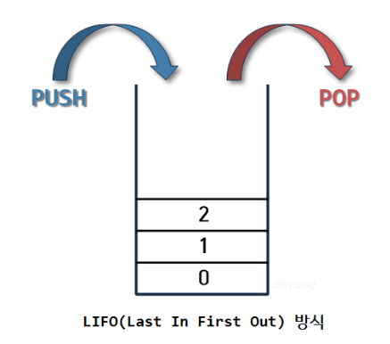
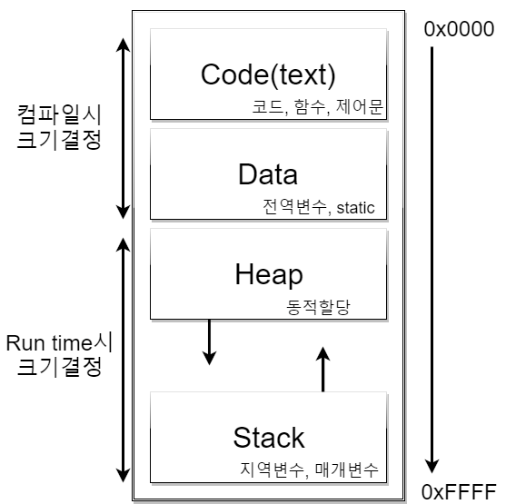

# 📖 Stack & Queue

## 목차

- [1. Stack](#stack)
  - [1.1 Stack의 주요 메서드](#stack의-주요-메서드)

## Stack

> 차곡차곡 쌓아 올린 형태의 자료구조, 데이터를 저장하는 자료형

cf) https://devuna.tistory.com/22

🔹 **스택(Stack)** 은 선형 자료구조의 일종으로 후입선출 즉, **Last In First Out (LIFO)** - 나중에 들어간 원소가 먼저 나오는 형태로 데이터를 저장한다. 이것은 Stack 의 가장 큰 특징이다.

🔹 스택은 같은 구조와 크기의 자료를 정해진 방향으로만 쌓을 수 있고, top으로 정한 곳을 통해서만 접근이 가능하다. top의 가장 위에 있는 자료는 최근에 들어온 자료를 가리키고 삽입되는 새로운 자료는 그 위로 쌓이게 된다. 이때, Stack에서 top을 통해 삽입하는 연산을 `push`, 삭제하는 연산을 `pop` 이라고 한다.

### Stack의 주요 메서드

1. `push()`, `pop()`
   - 스택에 새로운 원소를 삽입한다. 가득 차 있다면 예외를 던진다.
   - 최상층에 위치한 데이터를 읽어오고 해당 데이터를 스택에서 제거한다.
2. `isEmpty()`, `isFull()`
   - 각각 스택이 비어있는지, 가득찼는지를 boolean 형태로 리턴하는 메서드.
3. `peek()`
   - 최상층에 위치한 데이터를 읽어온다.

### Stack 메모리 영역과 Overflow

> 프로그램이 자동으로 사용하는 임시 메모리 영역이며, 스택(Stack)은 자료구조로서 메모리 영역을 관리한다.

cf) https://thenaeul.wordpress.com/2020/11/08/c%EC%96%B8%EC%96%B4-%EB%A9%94%EB%AA%A8%EB%A6%AC-%EC%98%81%EC%97%AD/

**Stack의 역할로는**

1. 함수 호출과 복귀 : 함수가 호출될 때 호출 스택에 함수의 정보(로컬 변수, 반환 주소 등)가 저장되며, 함수의 실행이 끝나면 해당 정보가 스택에서 제거되어 반환한다.   

2. 지역 변수 및 임시 데이터 저장 : 스택은 지역 변수(로컬 변수) 및 임시 데이터를 저장하는 데 사용된다. 함수가 호출될 때 해당 함수의 지역 변수가 스택에 할당되고, 함수가 종료되면 해당 지역 변수가 스택에서 제거된다. (즉, 잠시 사용되었다가 사라지는 데이터를 저장하는 영역)

만약, 너무 큰 지역변수를 사용하거나 재귀 함수가 종료되지 않고 무한으로 호출된다면 Stack이 쌓이게 되고 결국 Stack의 정해진 영역을 넘어 Heap의 영역을 침범해 `Stack Overflow`가 발생하게 된다. 

### Stack Overflow 해결 방법

1. Stack 영역의 크기를 늘리기
2. 존재하지 않는 인덱스나 주소를 찾고 있지는 않은지 확인하기
3. 해당 변수의 크기를 Stack보다 작게 만들거나, 무한 재귀 호출 막기

      